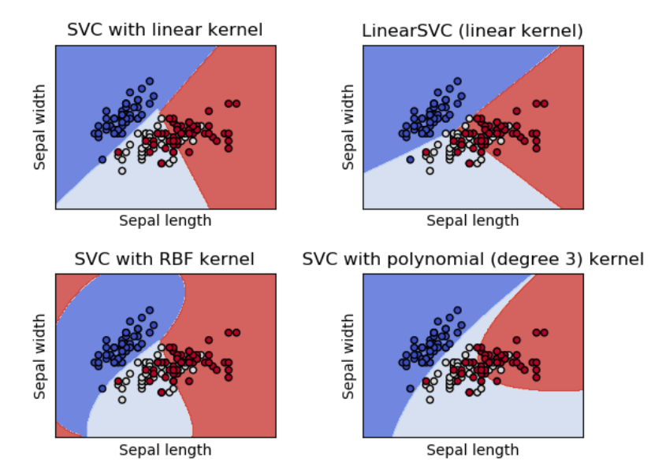
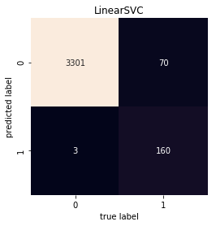
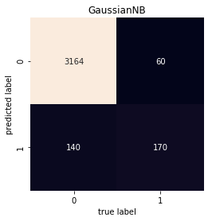
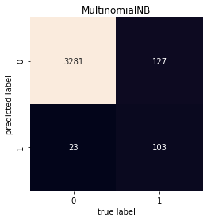
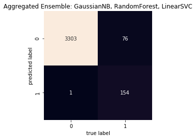

# Spam Filtering Using Various Supervised Learning Models

> [Mary Huibregtse](https://github.com/huibrm) & [Evan Frawley](https://github.com/evanfrawley)

> Problem Set 4, INFO 371, Data Science II, Machine Learning and Econometrics

> University of Washington

## Introduction

Spam filtering is a challenging problem to solve. Using appropriate learning algorithms and a well-labeled dataset, it is programmatically possible to determine which emails are important and which are spam. To do this, we utilize three different machine-learning techniques to predict which emails are spam: Naive Bayes, Random Forests, and Linear Support Vector Classification. We will explore the processes, results, and comparisons between the different algorithms.

Additionally, the goal of this assignment is to provide insight to a hypothetical company that wishes to invest in spam filtering methods. A few business goals have been established to provide a weighing mechanism to evaluate the models. The final model choice will be based on meeting the following goals in the order they are listed.

Business Goals in the order of importance:

- Minimize real ham emails that are classified as spam
  - Reasoning: Filtering important emails into the spam section can potentially be disastrous. If a user has an important email regarding their job, an interview, a family member, a bill, etc. be classified as spam unbeknownst to them, not seeing it can have a much greater impact on their life than a misclassified truly spam email.
- Maximize labelling of true spam emails as spam.
  - Reasoning: Allowing some spam emails to be classified as real is not a big issue. Users of the email service can ignore the spam emails or use their judgement to discern. We assume that our users are competent enough to understand when an email is spam.  


## Data

### Collection
The first step was to downloading our respective email archives from Gmail, including labelled “inbox” and “spam” emails. The downloaded files were in `.mbox` format, and parsed into raw `.csv` files using a Python library.

### Cleaning
Once parsing the payload out of the `.mbox` was completed, it was necessary to remove javascript, css, trailing spaces, blank lines, escape characters, links, punctuation, and stop words. Each row in the dataset represented an email; columns included date, subject, message ID, payload, and type (ham or spam). This dataset included 707 spam emails all received within 04/07/18 and 05/08/18, and 16,238 ham emails expanding over the past two years. It was unnecessary and difficult to work with such a large data set when creating a feature matrix, so we reduced the ham email count to 10,000, dropping emails dated last year.

Some emails only contained javascript and/or css. After the cleaning process, these emails became NA points. These points were dropped in our final dataframe (ham: 8 emails dropped, spam: 3 emails dropped).

### Models
The models that seemed to best fit the data were Naive Bayes, Support Vector Classification, and Random Forest.

#### Naive Bayes
Naive Bayes was the first learning algorithm chosen for classification. This was a natural choice since each distribution can be independently estimated as one-dimensional distribution. This minimized the curse of dimensionality and handles the feature-heavy dataset (in the case of email, there are more words in the English language than emails in a personal inbox/spam folder). Naive Bayes is also fast to train, which was ideal for the large, sparse dataset and minimal memory available.

It was prudent to consider the weaknesses of this algorithm, one of which is also mentioned above as a strength. It makes a strong assumption of the data distribution, and that all features are independent. This can lead to inaccurate predictions. Data scarcity is also another problem; as such, it is necessary to estimate a likelihood values by frequency. This can lead to values going towards 0 or 1, which can lead to numerical instabilities and inaccurate results. Binning must also be performed to get discrete data, which may throw away valuable information.

These weaknesses were combated with cross validation and using multiple performance metrics.  

The different kinds of Naive Bayes used were Multinomial, Gaussian, and Bernoulli.

#### Linear Support Vector Classification
Linear Support Vector Classification is a form of Support Vector Machine algorithm and is similar to SVM model;  the difference is that it supports a linear kernel and minimizes the square hinge loss. This algorithm defaults to one-vs-rest, which fits one classifier per class allowing insight about the class through inspecting the corresponding classifier. This method is also computationally efficient, iterable, flexible in choice of penalties and loss functions, and scales to a large number of data points. These strengths make it a reasonable choice for the sparse, large, and high dimensionality of a dataset with clearly defined linear classification. The images below show the differences in SVC.  




#### Random Forest
This classifier is an ensemble algorithm and tends to produce accurate predictions due to the randomized decision trees in each iteration of the bagging algorithm. On large datasets, Random forest reduces variance and creates a more general predictor. It also handles sparse datasets well. For these reasons, we decided it would be a reasonable classifier for our third algorithm

### Feature Extraction

To run these algorithms, we needed to convert the content of each word into a vector of numbers. This was performed using `sklearn` vectorizer. We did not use a raw word count as we feared this approach would put too much weight on words that appear frequently. Rather, we used term frequency-inverse document frequency (TF-IDF) which looks at the counts and weights of each word based on how often they appear in each email.  


Implementation of TF-IDF to create feature matrix:

```python
vec = TfidfVectorizer()
def getPrior(data, result):
     X = vec.fit_transform(data)
     prior = pd.DataFrame(X.toarray(), columns=vec.get_feature_names())
     prior['RESULT'] = result
     return prior
```


### Running models:
We ran the models first with no cross-validation as a baseline. To increase our accuracy and minimize bias and variance in our models, we implemented cross-validation by optimizing parameters through grid search. There was no significant difference between the outcomes before and after cross-validation.

Looking at the in-sample accuracy of each model after cross-validation, Random forest seemed to bet the best predictor of Ham and Spam.  
| Classifier | In-Sample Accuracy |
| --- | --- |
| `MultinomialNB` | 95.97% |
| `LinearSVC` | 98.98% |
| `RandomForest` | 99.18% |
| `GaussianNB` | 96.29% |
| `BernoulliNB` | 94.84% |

The performance of these models are further explored using AUC/ROC and confusion matrices.

## Results

### AUC ROC scores

For each of the five models, we computed the area under the receiving operating characteristic curve (AUC ROC). This area score shows the accuracy of the model being able to properly classify the test data into the appropriate bucket of spam or ham.
| Model Name | Score w/o `GridSearchCV` | Score w/ `GridSearchCV` |
| --- | --- | --- |
| `MultinomialNB` | 0.5019 | 0.7204 |
| `LinearSVC` | 0.8388 | 0.8474 |
| `RandomForest` | 0.8435 |  0.8388 |
| `GaussianNB` | 0.8484 | 0.8484 |
| `BernoulliNB` |  0.5707 |  0.7269 |

The best predictive model based purely the AUC ROC score is the `GaussianNB` model, classifying 84.8% of the testing data correctly. `LinearSVC` (83.8%) and `RandomForest` (84.4%) are close contenders for good models.

## Discussion

### AUC ROC scores

From the AUC ROC scores above, we can discern that `GaussianNB` consistently performed best of all of the models. Out of the testing data, the `GaussianNB` model correctly classified spam & ham emails 84.8% of the time. Though a fantastic score, both the `LinearSVC` and the `RandomForest` models performed better than expected.

To tease out the nuances in their performances, we created confusion matrices to look at the breakdown between actual labels and predicted labels.

### Confusion matrices

<div style="display: flex; flex-wrap: wrap; align-items: center; justify-content: center; width: 100%;">
  
  
  
  
  
</div>

Looking at the confusion matrices, the spam predictions for `MultinomialNB` and `BernoulliNB` both are disappointing. While both models are good at classifying ham emails, the ability to classify spam is close to a 50/50 chance, rendering the models useless for a spam-filtering task. However, taking a look at the other three models tells a more interesting story. Both `RandomForest` and `LinearSVC` have a near-perfect classification rate for labelled ham emails, while `GaussianNB` improperly classified a 124 ham emails as spam. Though this is the case, the `GaussianNB` model performs better in the AUC ROC score due to its higher classification rate for spam emails. While correctly classifying 10 and 14 spam emails more than `LinearSVC` and `RandomForest` respectively, the smaller test set size weighs the predictions of the `GaussianNB` model more. Given this, we sought to aggregate the best three models, to see if taking a rounded mean of predictions would produce to the desired goals.

| Model Name | Score w/ `GridSearchCV` |
| --- | --- |
| `LinearSVC` | 0.8474 |
| `RandomForest` |  0.8388 |
| `GaussianNB` | 0.8484 |
| `Aggregated` | 0.8346 |

Here is the code that generated the aggregated predictions:

```python
import math
import numpy as np
agg_preds_mat = np.array([preds2, preds3, preds4])
agg_preds_raw = map(sum, zip(*agg_preds_mat))
agg_predsl = [math.floor(pred / 2) for pred in agg_preds_raw]
```

Logically, this would give the following output for the following input:
```python
preds_gaussian = [0, 0, 0, 1]
preds_linearsvc = [0, 0, 1, 1]
preds_randomf = [0, 1, 1, 1]
# the summation of the parts gives us [0, 1, 2, 3]
# when divided by 2 and math.ceil is called on each, this is the output
[0, 0, 1, 1]
```



Examining the confusion matrix doesn’t seem to provide much better classifications than all three models put together, but we would expect the model to perform well when given data with high variance.

This interesting notion gives us an interesting decision point for weighing between the three models, a discussion to which we will return in the conclusion.

## Conclusion

In summary, our goal was to create a spam filter that maximizes the number of ham emails classified as ham and spam emails as spam. If we had to choose a single model to meet our business criteria, the `RandomForest` model performed best. If we were to prioritize spam emails being classified correctly, then our `GaussianNB` model performs the best. Given that the `RandomForest` model classifies the ham emails as ham overwhelmingly well, we suggest that the company invest resources in building out a spam filter using that algorithm.

## Future Work

If we had more time to work on this assignment, we would spend it on a bit more work on refining the model and testing against a larger set of emails.

### Model
We think that the aggregated ensemble model might work very well against a broad set of data and that our current models may have been overfitting to the training data. In the future, we’d implement smoothing (Laplace) and run a variety of `GridSearch`’s with more models and more parameters.

### Emails
Testing against one person’s email may have introduced some bias into the spam filtering model that wouldn’t work well to filter spam against other users’ inboxes. One of the thoughts that we had was that the gender that the user identifies as may have a significant influence on the types of emails that come in, so creating a generalized set of email to train on may be particularly helpful in creating a generalized spam filter. We’d love to spend more time collecting emails from many users of various genders, ages, and locations.
